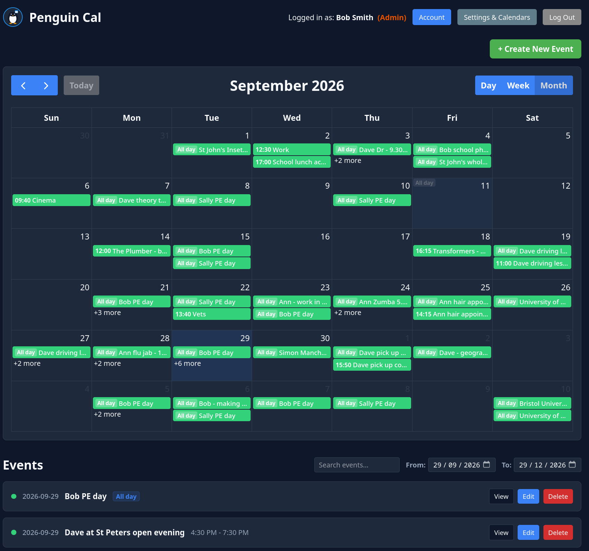
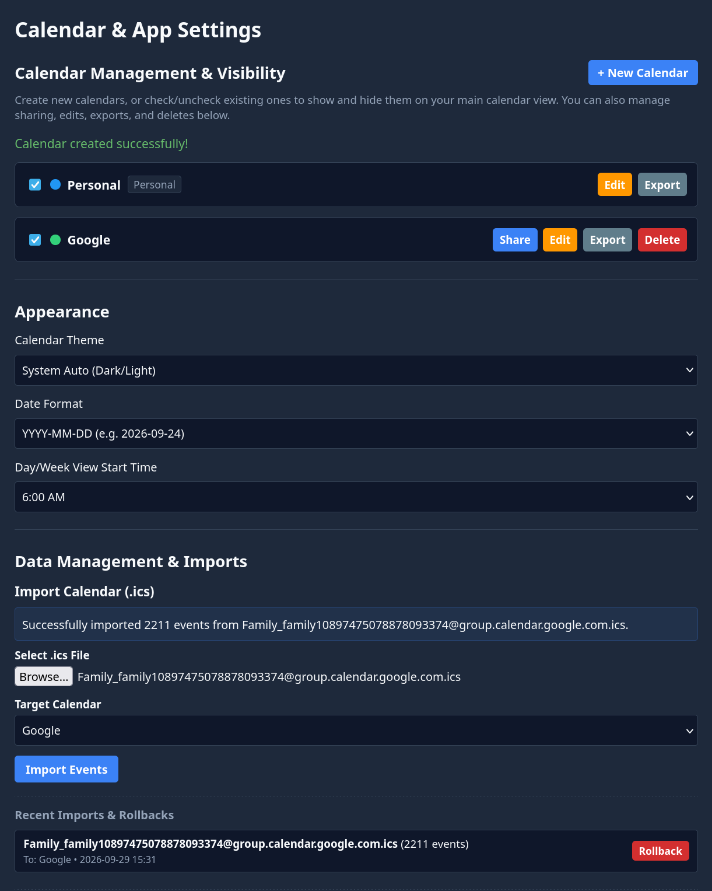

# Penguin Cal

**Penguin Cal** is a lightweight, multi-calendar suite built with a FastAPI backend and a React (Vite & FullCalendar) frontend. It supports advanced event management, recurring schedules (RRULE), calendar sharing, .ics file imports/exports, theme customizations, and built-in user administration.

## Features
* **Multi-Calendar Support**: Create, customize, and organize events across multiple personal or shared calendars.
* **Recurring Events**: Advanced recurrence builder supporting daily, weekly, monthly, and yearly repeats with customizable intervals and end conditions.
* **Calendar Sharing**: Securely share custom calendars with other registered users on the platform.
* **Import & Export**: Seamlessly export individual calendars to `.ics` format or import external `.ics` files.
* **Theme Customization**: Choose from multiple built-in themes (Light, Dark, Dracula, Nord, Solarized, Forest, Sunset) or stick with System Auto mode.
* **User Roles & Admin Panel**: Role-based access control with an integrated administration panel for managing users, resetting passwords, and toggling admin permissions.
* **Responsive Dashboard**: Fully responsive design tailored for both desktop and mobile views.

<div style="display: flex; align-items: flex-start; gap: 10px;">
  
  
</div>

## Running with Docker

### 1. Standalone Docker CLI (Without Docker Compose)
If you prefer to run the containers manually using the Docker CLI:

Create a shared network and persistent volume:
```bash
docker network create penguin-net
docker volume create penguin_data

```

Run the backend container:

```bash
docker run -d \
  --name penguin-backend \
  --network penguin-net \
  -v penguin_data:/app/data \
  -e JWT_SECRET=super-secret-key-change-this-for-production \
  --restart unless-stopped \
  mmozzano/penguin-cal-backend:latest

```

Run the frontend container:

```bash
docker run -d \
  --name penguin-cal \
  --network penguin-net \
  -p 80:80 \
  --restart unless-stopped \
  mmozzano/penguin-cal-frontend:latest

```

### 2. Simple Deployment (Docker Compose)

To run a simple setup using the standard compose file:

```bash
docker compose -f docker-compose.yaml pull
docker compose -f docker-compose.yaml up -d

```

### 3. Production Deployment (With Traefik and Homepage Integration)

To run the production setup configured with Traefik routing and Homepage label integration:

1. Create a `.env` file in the root directory based on the following template:


```env
DOMAIN=yourdomain.com
SERVICE=cal
SERVICE_NAME=Penguin Cal
GROUP=Applications
DESCRIPTION=Lightweight multi-calendar suite
JWT_SECRET=super-secret-key-change-this-for-production

```

2. Spin up the container using the production compose file:


```bash
docker compose -f docker-compose.prod.yaml pull
docker compose -f docker-compose.prod.yaml up -d

```

## License

This project is open-source and available under the MIT License.
